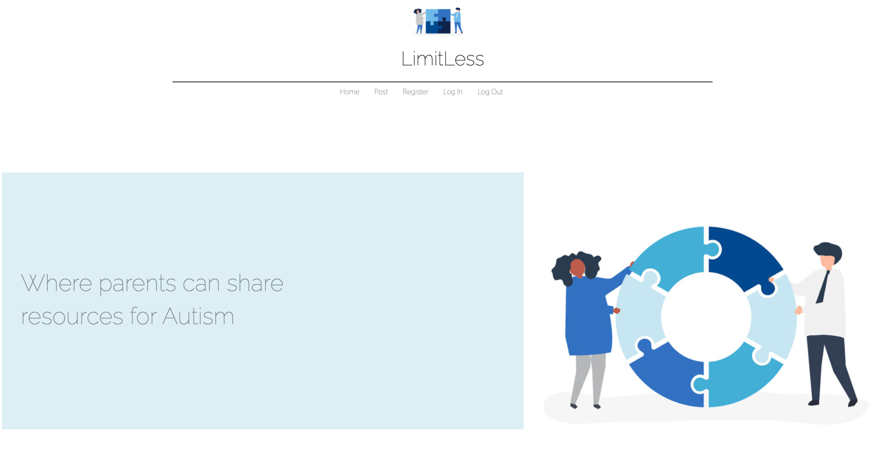
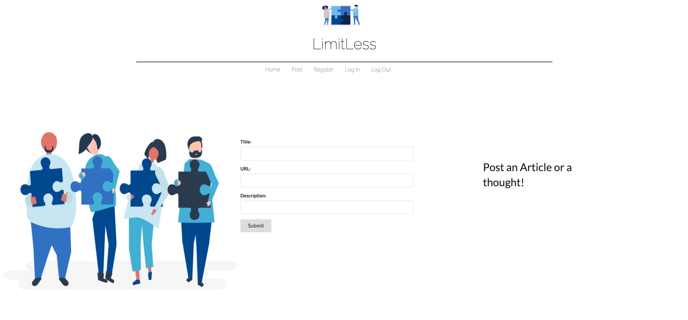
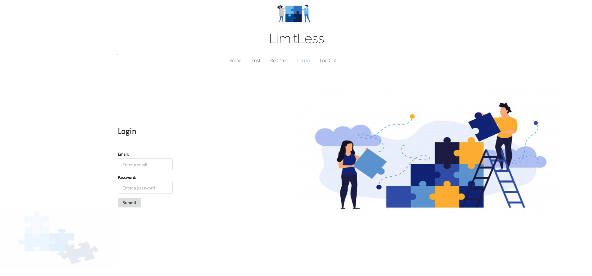
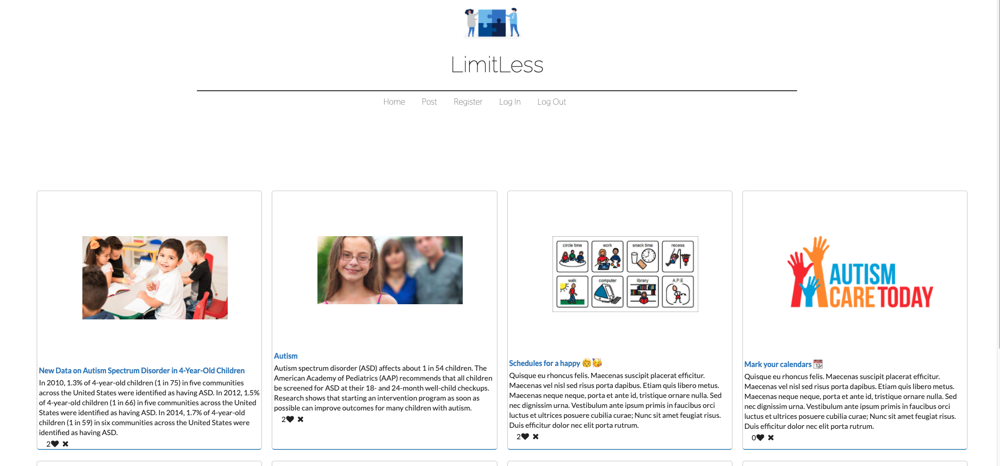
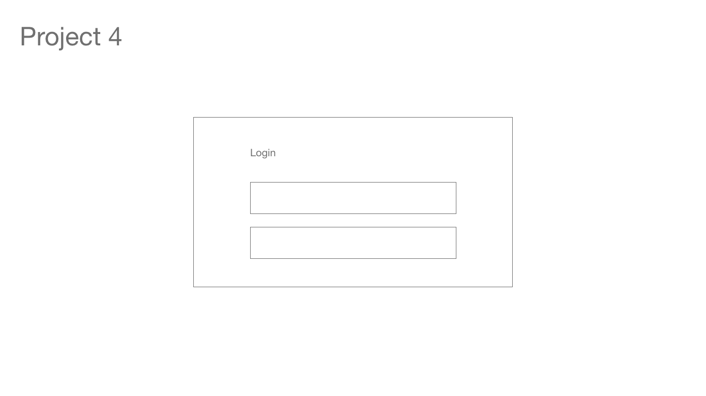
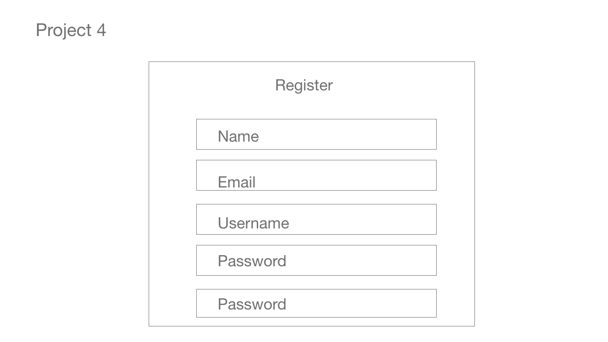
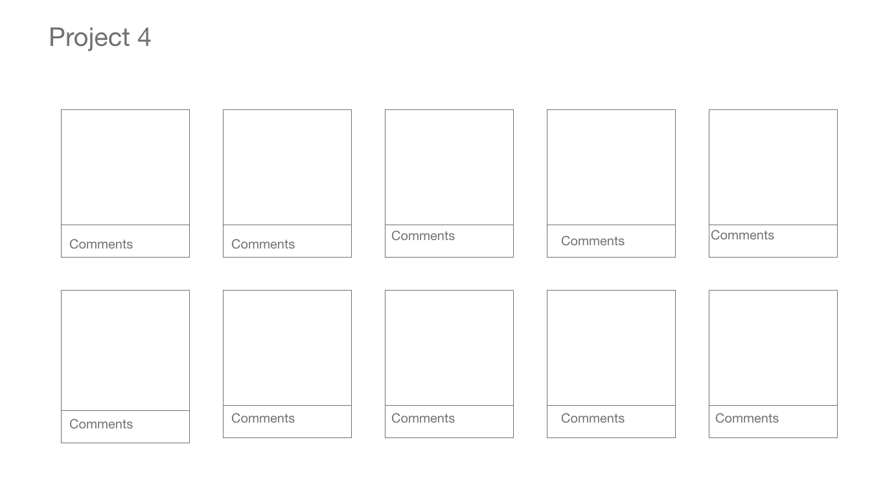
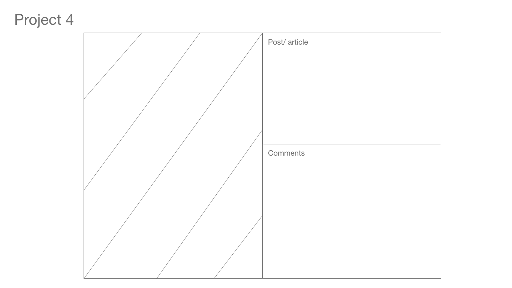

# LimitLess

## Descriptions
LimitLess is a full stack CRUD application built with Mern Stack and React as a front-end frameworks. This application was created as a social media platform for parents of children on the spectrum. Users can register, login, logout, post, and like another users post.

## Screenshots!

### Home

### Post

### Login

### Feed

### Technologies

* Mern Stack
  * Mongo
  * Express
  * React
  * Node.js

* Create-react-app

## Features
* Include:
  * Login/ Register
  * Create Post
  * Like a Post
  * Delete a Post

## Front-End Link

https://limitless-frontend.herokuapp.com/Start

* Git Hub Frontend
https://github.com/jasmine-snow/limitless-frontend

* Git Hub Frontend
https://github.com/jasmine-snow/limitless-backend

##  Wireframe

### Login Page

### Register Up

### Feed

### Show

## Resources:
  * General Assembly
  * https://www.youtube.com/watch?v=47OqlhksNIA&app=desktop
  * https://onury.io/accesscontrol/?content=guide
  * https://soshace.com/implementing-role-based-access-control-in-a-node-js-application/
  * https://github.com/expressjs/session#options
  * https://medium.com/@brandon.lau86/one-to-many-relationships-with-mongodb-and-mongoose-in-node-express-d5c9d23d93c2
  * https://www.itsolutionstuff.com/post/password-and-confirm-password-validation-in-reactexample.html
  * https://reactrouter.com/web/guides/quick-start
  * https://hdtuto.com/article/react-js-password-and-confirm-password-validation-example
  * https://devhints.io/react
  * https://www.youtube.com/watch?v=zSt5G3s3OJI
